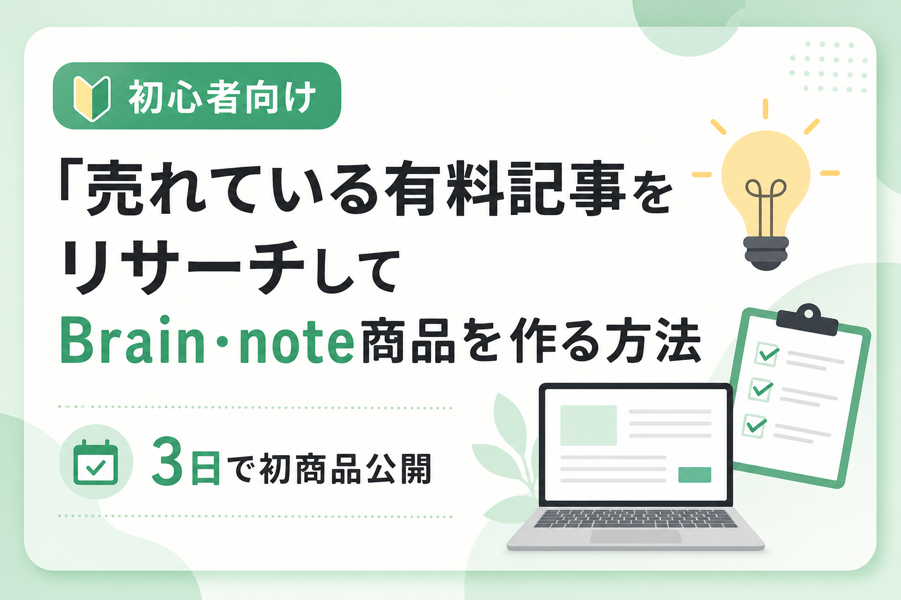
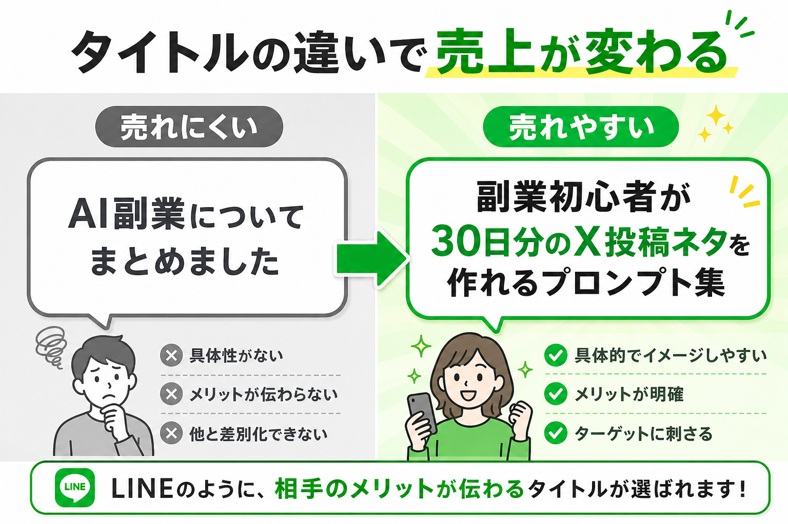
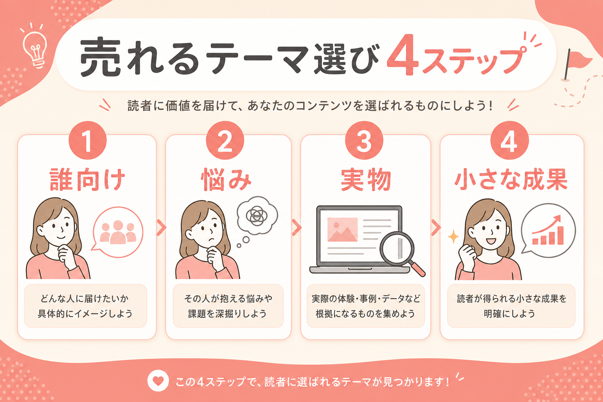
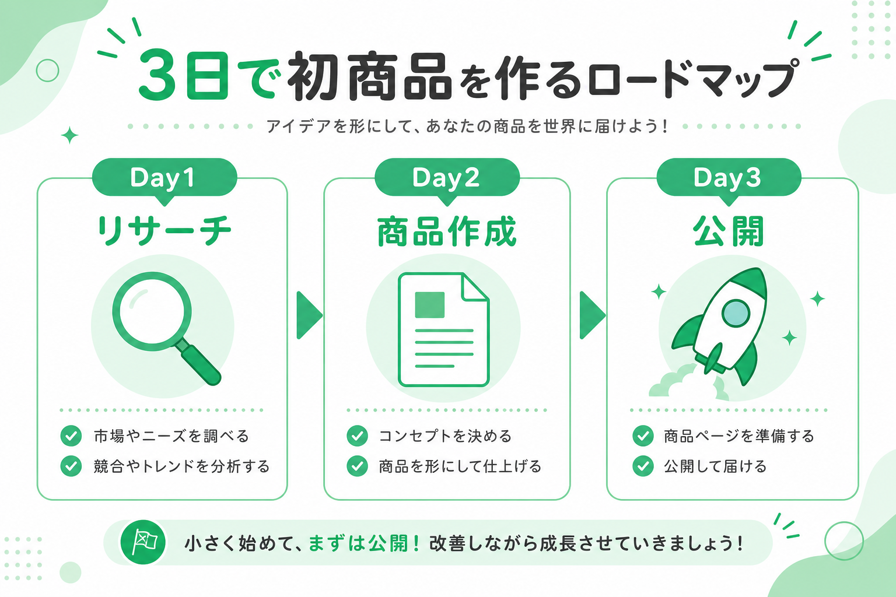
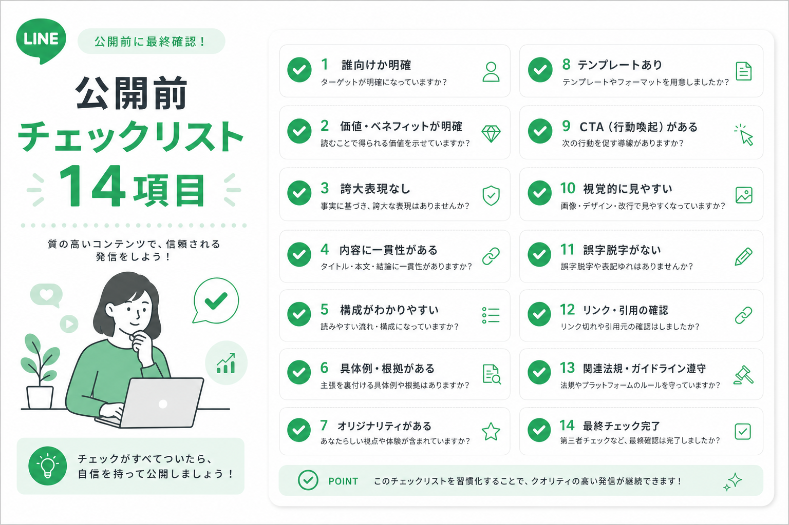

# 【初心者向け】売れている有料記事をリサーチして、自分だけのBrain・note商品を作る方法



---

> **💬 こんにちは。**
>
> この記事では、Brainやnoteで有料記事を出してみたい**初心者向け**に、
> 売れている有料記事をリサーチし、**自分だけの商品テーマ**に変換する方法を解説します。

---

## 🚨 最初につまずくポイント

いきなりですが、コンテンツ販売で最初につまずくポイントは、**文章力ではありません**。

多くの人が止まるのは、ここです。

╭──────────────────────────────────────╮
│  「何を書けば売れるのかわからない」      │
╰──────────────────────────────────────╯

ChatGPTを使えば、文章そのものは作りやすくなりました。

でも、いくらAIで文章を書けても、**テーマ選びを間違えると売れません**。

なぜなら、購入者は「記事」そのものを買っているのではなく、**自分の悩みが解決しそうな未来**を買っているからです。

---

## ⚖️ タイトル比較 — どちらが「買う理由」がある？

たとえば、次の2つを比べてみてください。

| ❌ 売れにくい | ✅ 売れやすい |
|:---|:---|
| AI副業についてまとめました | 副業初心者が**30日分のX投稿ネタ**を作れるプロンプト集 |



多くの人は、**後者**の方が「何が手に入るか」がわかりやすいはずです。

> **📌 ポイント**
>
> 有料記事で大事なのは、すごいことを書くことではありません。
> **買う理由があるテーマにすること**です。

---

━━━━━━━━━━━━━━━━━━━━━━━━
📚 **この記事でわかること**
━━━━━━━━━━━━━━━━━━━━━━━━

- Brain・noteで**売れやすい商品**の共通点
- 初心者が狙いやすい**有料記事ジャンル**
- 売れている記事を**リサーチする15項目**
- 他人の記事をコピーせず、**自分の商品に変換**する方法
- ChatGPTを使った**商品テーマ作成プロンプト**
- 有料記事の**構成テンプレート**
- Brain**販売ページ**の書き方
- **3日で初商品**を公開するロードマップ
- そのまま使える**チェックリスト**

---

## 👤 この記事が向いている人

✅ Brainやnoteで**初商品**を作りたい  
✅ AIを使って**有料記事**を作りたい  
✅ 何を書けば売れるのか**わからない**  
✅ 実績が少なくても作れる**テーマ**を探している  
✅ SNS発信を**収益化**したい  
✅ 自分の**経験を商品**に変えたい  
✅ 売れている記事の**共通点**を知りたい  
✅ **テーマ選び**で迷って手が止まっている  

> ⚠️ すでにコンテンツ販売で安定して売上がある人には、少し基礎的に感じるかもしれません。

---

## 🎯 先に結論

初心者が最初に作るべき有料記事は、次の条件を満たすものです。

| # | 条件 |
|:---:|:---|
| 1 | 誰向けかが**明確** |
| 2 | 悩みが**具体的** |
| 3 | 購入後に**すぐ使える** |
| 4 | テンプレートや**チェックリスト**がある |
| 5 | AIで**作業時間を短縮**できる |
| 6 | 自分の**体験や視点**を少しでも入れられる |
| 7 | **誇大表現なし**で売れる |

つまり、最初から「人生を変える完全教材」を作る必要は**ありません**。

むしろ、初心者が最初に作るなら、こういう商品の方が向いています。

- X投稿ネタ30日分テンプレ
- 副業プロフィール作成テンプレ
- ChatGPTプロンプト集
- Canva投稿構成テンプレ
- Brain販売ページテンプレ
- 初心者向けAI仕事時短チェックリスト
- note記事タイトル100本リスト
- 個人事業主向けタスク管理シート
- SNS発信ジャンル診断シート

> **💡 ポイント**
>
> 「すごいノウハウ」よりも **「面倒な作業を減らす実物」** です。

---

<!-- 🔒 ここから有料部分（Substack Paywall を上に設定） -->

---

## ▶ 第1章：なぜ初心者は「売れるテーマ選び」で失敗するのか

Brainやnoteで有料記事を出すとき、多くの初心者はこの順番で考えます。

```
① 自分が書けそうなことを探す
② ChatGPTで文章を作る
③ なんとなくタイトルをつける
④ 公開する
⑤ 売れない 😢
```

この流れで失敗する理由は、**購入者の悩みから逆算していない**からです。

╭──────────────────────────────────────╮
│  購入者が知りたいのは                 │
│  「で、買ったら何ができるようになるの？」│
╰──────────────────────────────────────╯

### ❌ 初心者が作りがちなテーマ

- 私のAI副業体験談
- ChatGPTを使ってみた感想
- noteを始めてわかったこと
- SNS運用で大切なこと

### ✅ 売れるテーマの例

- 副業初心者が**X投稿を30日続ける**ためのネタ帳
- ChatGPTで**有料記事の構成**を作るプロンプト集
- 実績ゼロの人が**Brain販売ページ**を書くためのテンプレート
- Canvaで作れる**Instagram投稿デザイン30パターン**
- 個人事業主がAIで**毎週の発信計画**を作る方法

**違いは、購入後の使い道が見えること**です。

---

## ▶ 第2章：Brain・noteで売れやすい項目

### 🤖 AI活用・自動化

今もっとも需要が強いのは、AI活用です。ただし「AIとは何か」の解説だけでは弱いです。

**売れやすい例：**
- ChatGPTで有料記事の構成を作る方法
- AIでX投稿ネタを100個作るプロンプト集
- Claudeで販売ページを改善する手順
- CanvaとAIでサムネイルを量産する方法
- AIでブログ記事の下書きを作るワークフロー
- AIで顧客対応文を作るテンプレート

### 📱 SNS運用

**買う人の悩み：**
- 投稿することがない
- 反応がない
- 何を売ればいいかわからない
- 発信しているのに収益につながらない
- 毎日続かない

**売れやすい例：** X投稿ネタ30日分 / Threads共感投稿の型 / Instagram投稿カレンダー など

### 💰 コンテンツ販売

Brainやnoteを買う人は「自分も売りたい」と考えていることが多いです。

**例：** 初めての有料記事作成ロードマップ / 売れるタイトルの作り方 / 販売ページテンプレート

### 📋 テンプレート・チェックリスト

ノウハウだけだと「読んで終わり」。**テンプレートがあると、購入者はすぐ手を動かせます。**

### 🗺️ 初心者向けロードマップ

「1日目に何をするか / 2日目に何を作るか / 3日目に何を公開するか」まで落とし込むと行動しやすい。

---

## ▶ 第3章：売れている記事をリサーチするときの15項目

以下をスプレッドシートにまとめてください。

| # | 項目 |
|:---:|:---|
| 1 | 記事タイトル |
| 2 | ジャンル |
| 3 | 対象者 |
| 4 | 解決している悩み |
| 5 | 約束している未来 |
| 6 | 商品形式 |
| 7 | 特典の有無 |
| 8 | 価格 |
| 9 | 実績の見せ方 |
| 10 | 無料部分のフック |
| 11 | 有料部分で提供しているもの |
| 12 | タイトルで使われている強い言葉 |
| 13 | 初心者向けか上級者向けか |
| 14 | AI・SNS・副業のどれに寄せているか |
| 15 | 自分ならどう別ジャンルに変換できるか |

**構造の例：**

```
初心者が → 特定の媒体で → 具体的な成果に近づく方法
```

→ この構造を別テーマに置き換える（本文コピーはNG）

---

## ▶ 第4章：コピーにならない「参考にする方法」

### 🚫 絶対にやってはいけないこと

- タイトルを少し変えただけで出す
- 本文構成をそのまま使う
- 特典名をほぼ同じにする
- 実績や数字を盛る
- 他人の体験談を自分の話のように書く
- 有料部分の内容を写す

### ✅ 参考にするべきこと

- 誰に向けているか
- どんな悩みに刺しているか
- どんな順番で説明しているか
- どんな特典が購入理由になっているか
- どのくらい具体的にしているか
- どの言葉で「自分ごと化」させているか

> **参考にするのは「文章」ではなく「設計」です。**

---

## ▶ 第5章：売れるテーマに変換する4ステップ



| Step | 内容 | 例 |
|:---:|:---|:---|
| **1** | **誰向けかを変える** | 副業初心者 / 主婦 / 個人事業主 / AI初心者 |
| **2** | **悩みを変える** | 「SNS運用」→「毎朝、何を投稿するか悩む時間をなくす」 |
| **3** | **実物をつける** | テンプレ / チェックリスト / プロンプト / 30日カレンダー |
| **4** | **小さな成果にする** | ❌月100万 → ✅初めての有料記事テーマを3つ作る |

---

## ▶ 第6章：初心者が作りやすい商品テーマ10選

<details>
<summary><strong>📦 商品テーマ一覧（クリックで展開）</strong></summary>

1. **AIでBrain販売ページを書くテンプレート** — 980〜1,980円
2. **X投稿ネタ30日分テンプレ** — 980〜1,980円
3. **note記事タイトル100本リスト** — 500〜1,480円
4. **初心者向けAI仕事時短チェックリスト** — 980〜2,980円
5. **Canva特典作成テンプレ** — 1,480〜2,980円
6. **Threads共感投稿テンプレ** — 980〜2,980円
7. **副業プロフィール文テンプレ** — 500〜1,480円
8. **有料記事リサーチシート** — 980〜1,980円
9. **個人事業主向けSNS投稿カレンダー** — 1,480〜2,980円
10. **AIで初商品を作る3日間ロードマップ** — 980〜2,980円

</details>

---

## ▶ 第7章：AIで商品テーマを作るプロンプト

```
あなたはBrain・noteの有料記事企画者です。

以下の条件で、初心者でも作りやすく、購入者がすぐ使える
有料記事テーマを30個出してください。

【条件】
・対象者：副業初心者 / AI初心者 / SNS発信初心者
・価格：980円〜2,980円
・誇大表現・収益保証なし
・テンプレート / チェックリスト / プロンプトを付けられる
・購入者の作業時間を短縮できる

【出力形式】
商品タイトル / 対象者 / 悩み / 商品内容 / 特典 / 売れる理由
```

**絞り込み基準：**
- [ ] 自分が少しでも経験・理解できるテーマか
- [ ] 購入者の悩みが明確か
- [ ] 1〜3日で作れるか
- [ ] テンプレやチェックリストを付けられるか
- [ ] タイトルを見ただけで中身が想像できるか
- [ ] 誇大表現なしで売れるか

---

## ▶ 第8章：有料記事の基本構成テンプレート

### 無料部分
1. 読者の悩みに共感
2. なぜその悩みが起きるのか
3. この記事で解決できること
4. 誰に向いているか / 向いていないか
5. 有料部分で得られるもの
6. 先に結論を少し見せる

### 有料部分
1. 全体像 → 2. 手順 → 3. 実例 → 4. テンプレ → 5. プロンプト → 6. チェックリスト → 7. 失敗例 → 8. ロードマップ → 9. まとめ

---

## ▶ 第9章：Brain販売ページのテンプレート

```
タイトル：【初心者向け】〇〇で□□を作る方法

冒頭：
「〇〇したいけど、何から始めればいいかわからない」
そんな悩みはありませんか？

この記事で得られるもの：
・〇〇の全体像
・□□の作り方
・すぐ使えるテンプレート
・ChatGPT用プロンプト
・公開前チェックリスト

向いている人：〇〇を始めたい人 / □□で悩んでいる人

向いていない人：上級者 / すぐに大金を稼げる方法だけを求める人

注意：収益を保証するものではありません。
```

---

## ▶ 第10章：売れるタイトルの作り方

**意識する4つ：** 誰向けか / 何ができるか / どのくらい簡単か / 何が手に入るか

**タイトルの型：**
- 【初心者向け】〇〇で□□を作る方法
- 実績ゼロから始める〇〇ロードマップ
- ChatGPTで〇〇を時短するプロンプト集
- 3日で〇〇を作る実践ガイド

---

## ▶ 第11章：特典の作り方

| ❌ 悪い例 | ✅ 良い例 |
|:---|:---|
| 豪華特典5つ | 初商品テーマを30分で絞るリサーチシート |

**おすすめ特典：** テーマ発見シート / リサーチ項目リスト / 商品企画AIプロンプト / 販売ページテンプレ / 公開前チェックリスト

---

## ▶ 第12章：3日で初商品を作るロードマップ



| 日 | やること |
|:---:|:---|
| **1日目** | リサーチ — 記事10〜20個を**分解**（タイトル・対象者・悩み・特典・価格） |
| **2日目** | 作成 — テーマ1つに絞り、下書き＋テンプレ・チェックリスト |
| **3日目** | 公開 — タイトル3案、無料/有料部分、特典、価格設定、**公開** |

---

## ▶ 第13章：公開前チェックリスト



- [ ] 誰向けの記事か明確
- [ ] 解決する悩みが具体的
- [ ] 購入後に何が手に入るかわかる
- [ ] 無料部分だけでも価値がある
- [ ] 有料部分に具体的な手順がある
- [ ] テンプレートやチェックリストがある
- [ ] AI出力をそのまま貼っていない
- [ ] 誇大表現・収益保証なし
- [ ] 他人の記事をコピーしていない
- [ ] 価格が初心者でも買いやすい
- [ ] 注意点を書いている
- [ ] タイトルが具体的
- [ ] 特典名がわかりやすい

---

## ▶ 第14章：この内容を使って作れる商品例

1. **【初心者向け】AIでBrain販売ページを作る方法**
2. **X投稿が続かない人のための30日ネタ帳**
3. **もう商品テーマで悩まない。有料記事リサーチシート**
4. **副業初心者のためのAIプロフィール作成テンプレート**
5. **AIでnote記事タイトルを100個作るプロンプト集**

---

## 📝 まとめ

Brainやnoteで有料記事を売るために、最初からすごい実績は必要ありません。

```
売れている記事を見る
    ↓
タイトル・対象者・悩み・特典を分解
    ↓
構造だけを参考にする
    ↓
自分の経験や視点に変換
    ↓
テンプレートやチェックリストをつける
    ↓
販売ページを作る
    ↓
小さく公開して改善する
```

**丸写しではなく、構造を学ぶこと。**

最初の1本は、完璧でなくて大丈夫です。今日リサーチを始めて、**3日以内に小さな商品を1つ**作ってみてください。

---

## 📎 付録：そのまま使えるAIプロンプト集

### プロンプト1：売れるテーマを探す

```
あなたはBrain・noteの有料記事マーケターです。

私は初心者向けに有料記事を作りたいです。
以下の条件で、売れやすい商品テーマを20個出してください。

【条件】
・対象者は初心者
・価格は980円〜2,980円
・すぐ使えるテンプレートやチェックリストを付けられる
・収益保証や誇大表現は使わない
・AI、SNS、コンテンツ販売のいずれかに関連する

【出力形式】
商品タイトル / 対象者 / 悩み / 提供物 / なぜ売れそうか
```

### プロンプト2：タイトルを作る

```
以下の商品テーマについて、Brainでクリックされやすいタイトルを30個作ってください。

商品テーマ：〇〇

【条件】
・誰向けかがわかる
・購入後に得られるものがわかる
・煽りすぎない / 誇大表現を使わない
・初心者向けにする
```

### プロンプト3：販売ページを作る

```
以下の商品について、Brain販売ページの下書きを作ってください。

商品名：〇〇 / 対象者：〇〇 / 解決する悩み：〇〇
商品内容：〇〇 / 特典：〇〇

【条件】
・冒頭で悩みに共感する
・得られるものを箇条書き
・向いている人 / 向いていない人を書く
・収益保証はしない
・初心者でも安心できる文章にする
```

### プロンプト4：チェックリストを作る

```
以下の商品テーマについて、購入者が実践時に使えるチェックリストを作ってください。

商品テーマ：〇〇

【条件】15項目以上 / 初心者向けの言葉 / 行動しやすい / 具体的
```

### プロンプト5：特典を作る

```
以下の有料記事に付けると購入理由が強くなる特典を10個提案してください。

記事テーマ：〇〇 / 対象者：〇〇

【条件】
PDF・スプレッドシート・プロンプト・テンプレートとして作れる
本編の実践を助ける / 特典名だけで価値が伝わる / 初心者がすぐ使える
```

---

> **⚠️ 販売時の注意**
>
> 本記事は収益や販売数を保証するものではありません。
> 他人の記事や有料部分をコピーすることは推奨していません。
> 公開情報を参考に、自分の経験・視点・提供物に変換して商品化するためのガイドです。

---

**—  END  —**
